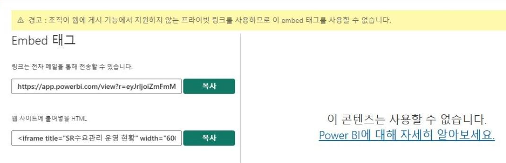

= Embed Tag 사용 불가 문제

오류 메시지:

== 문제 발생 이유

Power BI에서 해당 메시지가 발생하는 이유는 보안 정책의 상충때문입니다. **웹에 게시(Publish to Web)** 기능과 **프라이빗 링크(Private Link)** 설정은 서로 공존할 수 없는 기술적 특성을 가지고 있습니다.

=== 공개성 vs. 비 공개성의 충돌

* **웹에 게시 (Public)**: 이 기능은 보고서를 인터넷 전체에 공개하는 것입니다. 별도의 로그인이나 인증 없이 누구나 URL만 있으면 데이터를 볼 수 있도록 설계되었습니다.
* **프라이빗 링크 (Private)**: 조직의 데이터를 외부로부터 완전히 격리하여, 승인된 사설 네트워크(VNet) 내에서만 데이터가 흐르도록 강제하는 보안 설정입니다.

조직에서 프라이빗 링크를 활성화했다는 것은 **"모든 데이터 통신은 보호된 사설망 안에서만 이루어져야 한다"**는 엄격한 보안 규칙을 세운 것과 같습니다. 이 상황에서 인증 없는 외부 공개 기능인 '웹에 게시'를 허용하면 보안 체계에 구멍이 생기기 때문에, Microsoft는 프라이빗 링크가 켜진 테넌트에서 웹에 게시 기능을 자동으로 차단합니다.

=== 데이터 유출 방지(DLP) 메커니즘

프라이빗 링크를 사용하는 환경에서는 데이터가 공용 인터넷 엔드포인트를 거치지 않습니다. 하지만 '웹에 게시'를 사용하면 보고서 캐시와 데이터가 Microsoft의 공용 콘텐츠 전송 네트워크(CDN)로 복사되어야 합니다. 이는 데이터가 보안 경계 밖으로 나가는 것을 의미하므로 시스템이 이를 위험으로 간주하고 중단시키는 것입니다.

== 해결 방안

해당 기능을 반드시 사용해야 한다면, 보안을 유지하면서 보고서를 공유할 수 있는 다른 방법을 검토해야 합니다.

1. 방법 A: 보안 내장(Secure Embed) 사용 +
'웹에 게시' 대신 '사용자 또는 그룹에 게시(Embed for your organization)' 기능을 사용하세요.
+
사용자가 보고서를 보려면 반드시 로그인을 해야 하며, 조직의 보안 정책(Private Link 포함)을 준수하며 안전하게 접근할 수 있습니다.

2. 방법 B: Power BI Embedded (App Owns Data) +
조직 외부 사람에게 보여줘야 한다면, API를 이용한 Embedded Capacity를 활용하세요.
+
인증된 포털을 통해 보고서를 안전하게 전달할 수 있으며, 프라이빗 링크 환경에서도 서비스 주체(Service Principal)를 통해 제어가 가능합니다.

방법 C: 프라이빗 링크 해제 (비권장)
조직 전체의 Private Link 설정을 해제하면 다시 '웹에 게시'를 사용할 수 있지만, 이는 조직 전체의 보안 수준을 낮추는 행위이므로 보안 담당자와 신중히 상의해야 합니다.

== 작업 영역 수준 프라이빗 링크를 사용

작업 영역(Workspace) 수준의 프라이빗 링크만으로는 "웹에 게시" 문제를 해결할 수 없습니다.

그 이유는 Microsoft Fabric과 Power BI의 보안 구조상 프라이빗 링크 설정은 테넌트(조직) 전체의 보안 규정을 따르기 때문입니다. 상세한 이유와 현재 상황에서 가능한 최선의 대안을 정리해 드립니다.

1. 해결이 불가능한 이유 (기술적 한계)
* 상속 구조: 프라이빗 링크는 테넌트(조직) 수준에서 활성화되는 기능입니다. 일단 조직에서 프라이빗 링크를 사용하기로 설정하면, 그 아래에 있는 모든 작업 영역은 **"보안이 강화된 사설망 모드"**로 작동합니다.
* 기능 비활성화: "웹에 게시" 기능은 보안이 없는 공용 인터넷 경로를 사용합니다. 테넌트 수준에서 프라이빗 링크가 켜져 있으면, 개별 작업 영역에서 어떤 설정을 하더라도 공용 인터넷으로 데이터를 내보내는 행위 자체가 시스템적으로 차단됩니다.
* 작업 영역 수준의 한계: 작업 영역 수준에서 프라이빗 링크를 관리한다는 것은 특정 작업 영역의 데이터를 더 엄격하게 격리하는 용도이지, 테넌트의 금지된 보안 규칙(공용 게시 차단)을 우회하게 해주는 기능은 아닙니다.

2. 권장하는 해결 경로 +
"웹에 게시"를 사용할 수 없는 환경에서 보고서를 외부나 내부에 공유해야 한다면, 다음의 단계별 해결책을 검토해 보세요.

=== Step 1. 내부/협력사 공유가 목적인 경우

**보안 내장(Secure Embed)**을 사용합니다. 사용자에게 라이선스가 있다면 가장 안전하고 확실한 방법이며, 프라이빗 링크 환경에서도 완벽하게 작동합니다.

=== Step 2. 불특정 다수에게 공개가 꼭 필요한 경우

조직의 보안 정책을 담당하는 관리자에게 다음 사항을 확인 요청해야 합니다.

1. 테넌트 설정 변경: 관리 포털의 Azure Private Link 설정에서 공용 네트워크 액세스 차단을 **'사용 안 함(Disabled)'**으로 변경할 수 있는지 확인합니다. 
2. 보안 그룹 예외: "웹에 게시" 허용 설정을 '조직 전체'가 아닌 **'특정 보안 그룹'**에게만 허용하도록 관리자에게 요청하여, 해당 그룹에 속한 사용자만 예외적으로 게시 기능을 쓰게 할 수 있습니다.